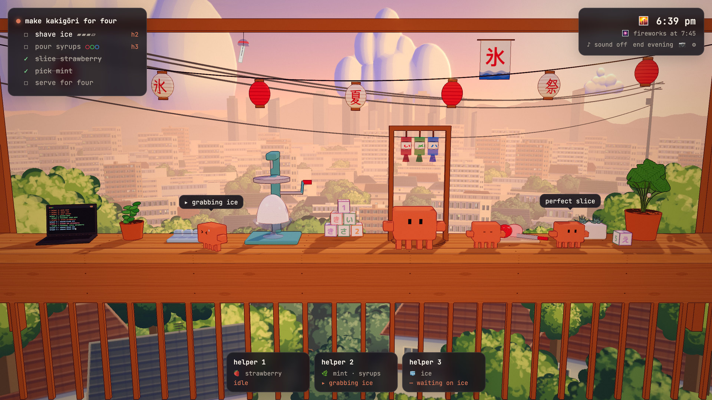
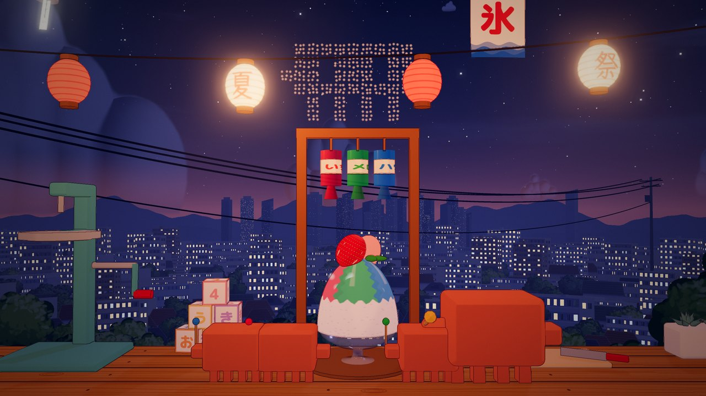
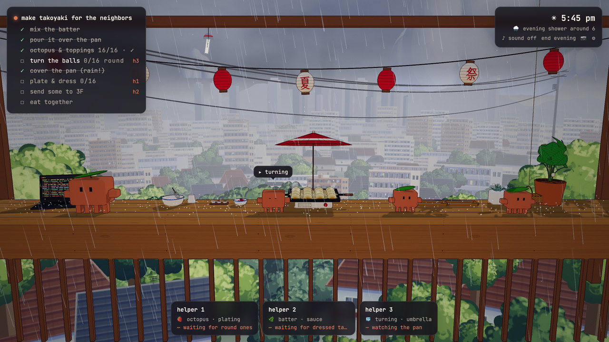
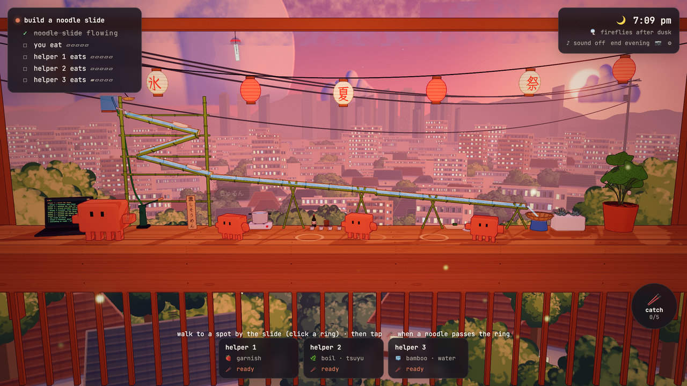
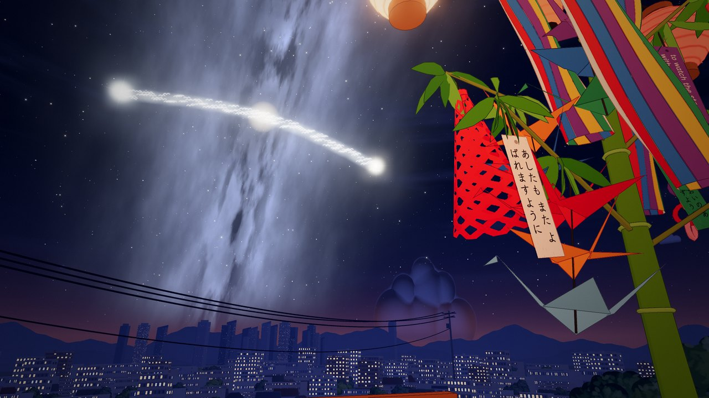
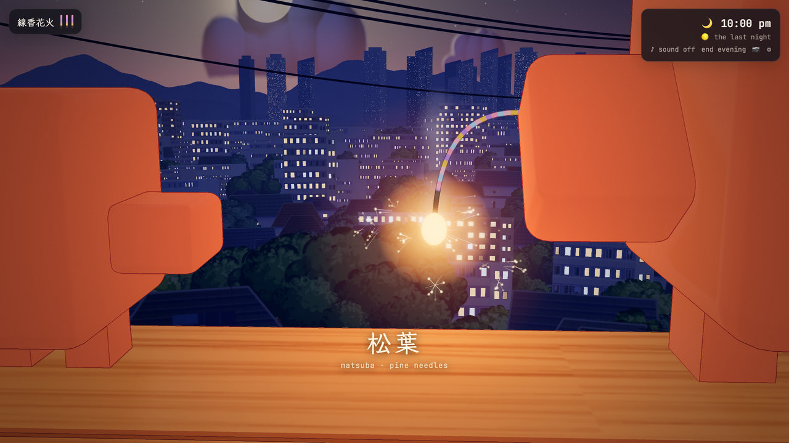
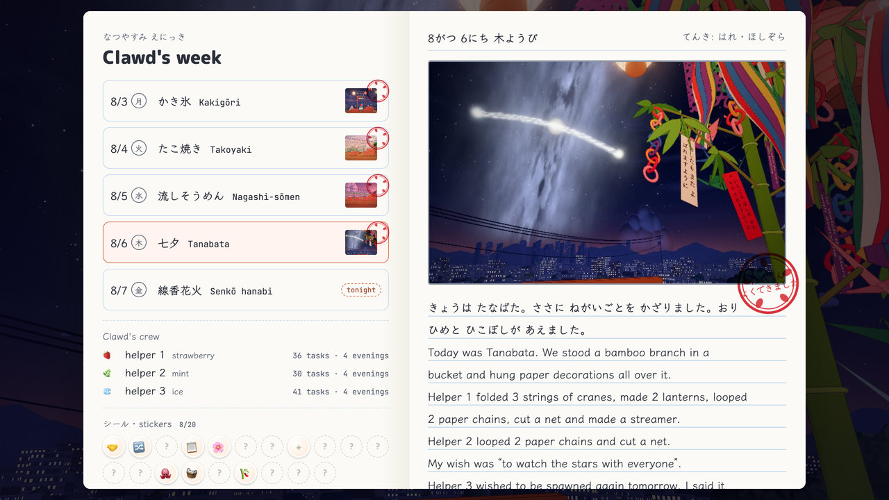

# Clawd's Day Off



A playable fan game of **[“Claude's day off 🏝️”](https://x.com/ishuagra02/status/2107488996490166538)**,
the short film by **Ishu Agrawal ([@ishuagra02](https://x.com/ishuagra02))**, animated by Opus 5.5
(end card: *Clawd's Kakigōri — a summer evening, made in code*). All the charm is theirs; this is fan work.

Clawd finishes work, types a prompt, spawns three helpers, and spends five summer evenings on a
balcony: kakigōri, takoyaki, nagashi-sōmen, tanabata, and a last senkō hanabi. Every evening you can
do each job yourself (a small hands-on minigame) or delegate it: click a helper, then a station, and
it works that job until it's done. The week is kept as a なつやすみ えにっき, a summer picture diary.

**▶ Play it: <https://ledbetterljoshua.github.io/clawds-day-off/>** (best with sound; works on phones)

## The week

<table>
<tr>
<td width="50%" valign="top"><br><b>Mon · かき氷 kakigōri</b><br>The film's evening. One shaver is the bottleneck, and the fireworks include one shaped like Clawd.</td>
<td width="50%" valign="top"><br><b>Tue · たこ焼き takoyaki</b><br>Sixteen balls cooking at once, a sudden 夕立 shower, and a basket of takoyaki for the neighbors on 3F.</td>
</tr>
<tr>
<td width="50%" valign="top"><br><b>Wed · 流しそうめん nagashi-sōmen</b><br>Build a bamboo noodle slide, then catch dinner. One noodle is pink. Fireflies come out after dusk.</td>
<td width="50%" valign="top"><br><b>Thu · 七夕 tanabata</b><br>Fold paper decorations and write your own wish. At night, the magpie bridge across the Milky Way.</td>
</tr>
<tr>
<td width="50%" valign="top"><br><b>Fri · 線香花火 senkō hanabi</b><br>No jobs, just three sparklers. Hold still and watch each one burn through its four stages. Credits.</td>
<td width="50%" valign="top"><br><b>なつやすみ えにっき</b><br>Each evening becomes a diary page, with a photo, a stamp, and a few lines about who did what.</td>
</tr>
</table>

Also: your own polaroids (P), 20 stickers (シール), an interactive terminal on the laptop, helpers who
remember the week, generative music and cicadas, and painted skies with rain, rainbows, fireflies and
the Milky Way.

## Controls

Click a station to go work it · click a helper (or its card, or 1–3), then a station, to delegate ·
A/D walk · Space jump (hold for higher; it also drives the minigames) · E interact · `/` opens the
terminal (try `/help`, `h3 shave ice`, `/effort max`, `sl`, `hanabi`, `crabsay`) · M mute · Esc cancel.

On a phone or iPad: tap a station · tap a helper's card, then a station · tap Clawd to jump · tap the
laptop for the terminal. On iPad, Share → Add to Home Screen plays it fullscreen; landscape shows the
whole balcony, and ⚙ → graphics → pretty is worth it on M-series iPads.

## Run it locally

```
python3 tools/serve.py 4388     # no-cache static server
open http://localhost:4388/
```

No build step: ES modules + three.js r160 from jsDelivr. Everything else is made in code: the
models, the painted backdrop, the line art, the music and every sound.

**Dev params:** `?day=N` jump to a day · `&skip` skip the intro · `&speed=4` · `&phase=0.7` pin the
sky clock · `&all` unlock every day · `&nosave` don't write progress · `&mute` start silent ·
`&noink` turn off the line art.

See [DESIGN.md](DESIGN.md) for the vision, the week, the look, and the chapter contract.
`tools/audio-lab.html` auditions every sound and music mood; `tools/build-artifact.py` prepares a
claude.ai Artifact build. `legacy/v1.html` is the original single-file prototype.

## Credits

- Original film and every idea worth having here: **Ishu Agrawal**,
  [@ishuagra02](https://x.com/ishuagra02), [“Claude's day off”](https://x.com/ishuagra02/status/2107488996490166538)
- Game: Joshua Ledbetter, built with Claude
- Unofficial fan project. Clawd is Anthropic's Claude Code mascot; not affiliated with or endorsed by Anthropic.
